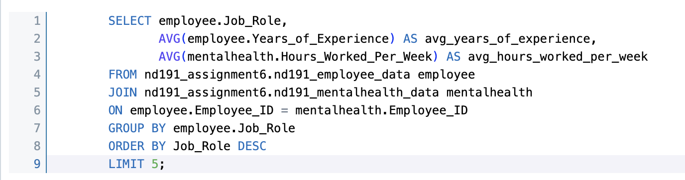

# Nakiyah_Assignment6

[](https://github.com/nogibjj/Nakiyah_Assignment6/actions/workflows/cicd.yml)

# Project: ETL-Query Pipeline with Databricks

```
Nakiyah_Assignment6/
├── .devcontainer/
│   ├── devcontainer.json
│   └── Dockerfile
├── .github/
│   └── workflows/cicd.yml
├── .gitignore
├── Data/
│   ├── EmployeeData.csv
│   ├── MentalHealthData.csv
│   └── Impact_of_Remote_Work_on_Mental_Health.csv
├── mylib/
│   ├── extractData.py
│   ├── loadData.py
│   └── queryData.py
├── main.py
├── test.py
├── Makefile
├── README.md
├── Requirements.txt
└── complecxQueryLog.md

```
## Purpose of this project

### Project Overview
This project implements an ETL (Extract, Transform, Load) pipeline that processes data from external public datasets and stores it in a SQLite database. The key stages of the pipeline are as follows:

Extract: Data is fetched from a public GitHub repository, split into two DataFrames, cleaned, and saved into CSV files.
Transform: The CSV files are read into pandas DataFrames, processed, and prepared for insertion into Databricks SQL tables, which includes cleaning and transforming the data formats.
Load: The cleaned and transformed data is loaded into Databricks SQL tables.
Complex Query Execution: After the data is loaded, the pipeline allows for running SQL queries. 

# Complex Query Explanation



The complex SQL query joins two tables (nd191_employee_data and nd191_mentalhealth_data), groups by job role, and calculates the average years of experience and hours worked per week for each role. Results are sorted in descending order of job role, with a limit of 10 rows.


Every time a query is executed, the SQL command and its corresponding Databricks response are logged in a file (complexQueryLog.md). This allows tracking the results and keeping an audit trail.

Usage
The pipeline can be run from the command line:

Data extraction: python3 main.py extract
Data loading: python3 main.py load
Run a SQL query: python3 main.py query "SELECT * FROM nd191_employee_data;"
The repository uses environment variables and Databricks credentials (stored in an .env file) for secure connection and execution.

Project Testing
Automated tests in test.py use subprocess calls to run the CLI commands and verify that each step of the ETL process and querying works as expected.

This setup provides a complete end-to-end pipeline for managing data extraction, transformation, loading into Databricks, and executing complex queries.

